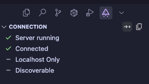

# IDE Integration - Alpha


Supports Visual Studio Code and Cursor




### Download the GooseCode extension

Using the `extensions` view in your supported IDE, search for GooseCode.&#x20;



### Select the GooseCode extension view


This is probably in your overflow menu next to when your file explorer is. Try clicking the downwards facing chevron.


### Follow the walkthrough in your IDE


Cursor currently has a bug which prevents walkthroughs from showing.




### Broadcast

You can broadcast your extension so that GooseCode can detect it. When you hover over `connection` you should see a arrow pointing to a dot. Click that.


Broadcasting uses mDNS so that GooseCode can connect, but it does not broadcast your connection password.


<figure><figcaption></figcaption></figure>




### Copy your password

Click the copy button to copy the extension password into your clipboard.



### Return to GooseCode

Open the `IDE` tab in the `explorer` pane.&#x20;



### Fill in your connection Details


If you chose to broadcast, you should see `Discovered services` .&#x20;

Click the :heavy\_check\_mark: to fill the extension IP and port.&#x20;

Paste the password you copied from the extension earlier.



Connections between your IDE and GooseCode are TLS secured.


<figure><figcaption></figcaption></figure>



### Open a workspace in your IDE

If you don't already have a workspace you will need to open something before you can do anything.&#x20;



### Enable the workspace as a "Code Source"

In your IDE, open the GooseCOde extension view again and hover your workspace. Click the toggle icon that appears on the right.



### Return to GooseCode

You should see a green tick for both your connection and your code source.



### Add a file

Click the mouse cursor icon in GooseCode next to your code source name. You should see files appear below. Collapse your connection details to make some more room.

Click a file from the file explorer and it will be added to your canvas.



## :tada: Snippets

Now we can explore the real power of GooseCode for code exploration and documentation.



### Return to your IDE



### Select some code



### Send as a snippet

Windows: `alt+ctrl+s`

MacOS: `alt+ctrl+cmd+s`


You should now see the code you selected added to the canvas in GooseCode.




### Send as a miniaturized snippet

Windows: `alt+ctrl+m`

MacOS: `alt+ctrl+cmd+m`


You should see the selected code added to GooseCode in a collased format.



These are great for enriching code with context, without taking up too much visual space.cx




## :sparkles:Code Generation - Swimlanes

Adding code to the canvas is one thing, but what we're really here for is to understand relationships.

We all know and love swimlanes to visualize information flows, using this feature we can quickly generate swimlanes which show actual lines of code to fully understand the movement of information around our programs.


When following symbols, you must make sure you're not currently selecting a range of characters otherwise you'll generate a snippet instead.




### Return to your IDE



### Click on the use of a function


For best effect for this walkthrough, click on a usage, not a declaration. This of this like `go to definition` , infact, it will do exactly that.




### Generation a definition connection

Windows: `alt+ctrl+g`

MacOS: `alt+cmd+g`&#x20;


Woah what just happened?&#x20;

You should now be looking at a number of added canvas objects, including a connection between two pieces of code from where you started, to the definition of the function.

You should also have been navigated in your code as if you had clicked `go to definition`



Nothing happen?&#x20;

Check your keyboard shortcuts in your IDE.




### Generation a reference connection

Follow the steps from 3 but this time click on the actual function definition.


You should see a drop-down appear at the top of your IDE. Select a reference to visualize from the list.




### Generate a swimlane snippet

Similar to [#code-generation-snippets](ide-integration-alpha.md#code-generation-snippets "mention") if you select a range of text use the generate keyboard shortcuts:&#x20;

Windows: `alt+ctrl+g`

MacOS: `alt+cmd+g`&#x20;

You will see again snippets being added to the canvas, only this time they are added as context into the generation section.




You can resume a generation session by double clicking the generated `section` in the GooseCode canvas.


***

## Cross Device Connection

It is possible to connect GooseCode on one device to another device on the same network.


You can disable this by toggling `localhost only` in the GooseCode extension in your IDE.



This is great for users who also have an iPad and want to use it for GooseCode while programming on their desktop / laptop.


After ensuring that `localhost only` is disabled, we recommend using the mDNS broadcast to get the IP of you IDE machine.


If you don't want to or can't use the mDNS broadcast feature, you will need to discover your IP manually using your command line.&#x20;

For example:\
`❯ ifconfig | grep '192.'`\
`inet 192.168.0.8 netmask 0xffffff00 broadcast 192.168.0.255`&#x20;

Note: `'172.'` and `'10.'` are also common IP prefixes.


***

## Go Further

To learn about how you can use your IDE connection to its maximus potential see[going-beyond-basics.md](going-beyond-basics.md "mention")
